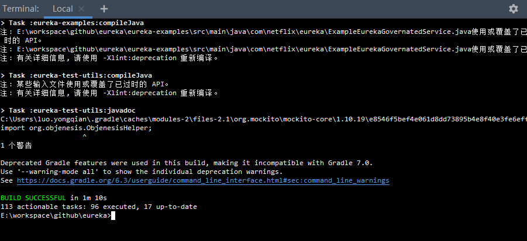
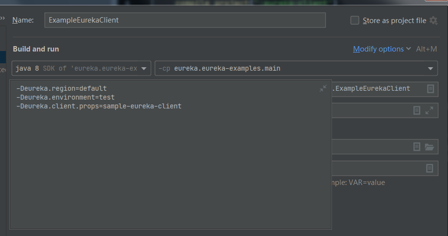

# Eureka安装

> eureka版本为当前最新版：1.10.12-SANPSHOT。如果版本不一样，下面的一些细节操作和结果可能会不一样。请以实际的版本为准。

## 1、环境准备

- Gradle

  - 默认会下载gradle-6.3 版本。大于或者小于均可能因为版本不兼容而出现各种神奇的问题，所以我们最好是使用此gradle版本而避免一些因为不兼容而带来的不必要的麻烦。

  - 例如以下异常

    - Cause: org.jetbrains.plugins.gradle.tooling.util.ModuleComponentIdentifierImpl.getMethod...
      - 这个异常是于由gradle版本太低导致
    - java.lang.AbstractMethodError: org.jetbrains.plugins.gradle.tooling.util.ModuleComponentIdentifierImpl.getModuleIdentifier()Lorg/gradle/api/artifacts/ModuleIdentifier;
      - 这个异常是由于IDEA版本太低，不兼容高版本的Gradle导致(我测试的是IDEA2018,gradle是6.3)

    当一切都正常后，整个项目如下图所示：

    

  上图“BUILD SUCCESSSFUL ”对应的命令如下：

  >  gradle clean build -x test

  

- Git

  - 没有版本要求，能正常从git下载代码即可。

- JDK

  - 1.8+

- 网络准备

  - 很有必要"翻墙"，因为gradle默认下载均是需要“翻墙”的。

## 2、下载源码

> https://github.com/Netflix/eureka

或者下载已经打包好的源码

> https://github.com/Netflix/eureka/releases

## 3、官方安装步骤 

> https://github.com/Netflix/eureka/wiki/Building-Eureka-Client-and-Server

- linux下

```shell
cd eureka
./gradlew clean build
```

- windows下(一)

```shell
D:\IdeaProjects\eureka>gradle clean build
或者
D:\IdeaProjects\eureka>gradle clean build -x test
```



> 如果有一些报错，请调整IDEA 或者 Gradle版本。同时，最好能够正常的访问"外网"

- windows下(二)

使用eureka项目自已的gradlew.bat脚本，此需要会默认下载gradle-6.3-bin.zip(此处需要翻墙^_^)，


build完成后，会在对应的项目生成结果文件：


-

将对应的war包修改名称为eurake.war，然后放置到tomcat的webapps目录下，启动tomcat即可。


> 正常情况启动会报错：com.netflix.discovery.shared.transport.TransportException: Cannot execute request on any known server

原因是eurake机制决定的，当eureka-server启动时，会将自已当作一个服务注册的注册中心,也就是当前服务本身。

解决方法是修改配置文件`D:\javasoft\apache-tomcat-7.0.90\webapps\eureka\WEB-INF\classes\eureka-client.properties`

禁止eureka-server启动时，将自已注册到注册中心和从注册中心拉取服务。

具体需要添加配置项：

```properties
eureka.registration.enabled=false
eureka.shouldFetchRegistry=false
```

## 4、 测试

访问路径 ：http://localhost:8080/eureka/

> 具体路径与tomcat配置有关，eureka-server只是一个普通的打成war包的web项目。


> 上图已经有应用注册了，如果正常启动应该是没有应用注册的

## 5、启动service provider

找到`eureka-examples`下的`ExampleEurekaService`类


配置启动VM参数：


启动ExampleEurekaService


上述白色字体的日志已经打印出来，表示服务已经正常启动，正在等待请求。

再去eureka控制台看界面，相对于第4章节的头部红色文字已经没有了。那个红色文字的是因为eureka有一种自我保护机制的提醒，当服务下线率(即服务停止或者网络问题导致心跳检测失败)超过85%,就会出现这个提示。

所以当我们正常启动应用时，这个红包提示消失。


## 6、启动service consumer

找到`eureka-examples`下的`ExampleEurekaClient类


配置启动VM参数：



启动测试


白色日志打印，表示已经从service provider中获取到了对应的请示结果。

## 7、测试配置文件分析

- 注册中心配置(eureka-server.war)

  **eureka-server.properties**

  ```properties
  ## Set this only for this sample service without which starting the instance will by default wait for the default of 5 mins
  #eureka.waitTimeInMsWhenSyncEmpty=0
  
  ## for the example, set this to zero as we will not have peers to sync up with.
  ## Do not set in a real environment with multi-node eureka clusters.
  #eureka.numberRegistrySyncRetries=0
  
  ## for cascade loading of property files for different deployment environments and/or regions etc,
  ## see archaius cascade loading: https://github.com/Netflix/archaius/wiki/Deployment-context
  
  ```

  > 注册中的server端配置默认是空

  **eureka-client.properties**

  > 这个是在eureka-server中的client配置，此时，eureka-server本身也就是一个普通的service provider或者service consumer的角色。

  ```properties
  ##Eureka Client configuration for Eureka Service
  
  # Properties based configuration for eureka client that is part of the eureka server.
  # Similar eureka-client.properties configs can be used for the entire eureka ecosystem (i.e. for both the
  # eureka servers as well as registering webapps), with minimal changes to application specific properties
  # (see below for these).
  #
  # The properties specified here is mostly what the users need to change.
  # All of these can be specified as a java system property with -D option (eg)-Deureka.region=us-east-1
  
  ## -----------------------------------------------------
  ## The below properties are application specific.
  ## Each new application should set these as appropriate.
  ## -----------------------------------------------------
  
  # Region where the application is deployed.
  # - for AWS specify one of the AWS regions
  # - for other datacenters specify a arbitrary string indicating the region.
  #   This is normally specified as a -D option (eg) -Deureka.region=us-east-1
  # region属于AWS云的概念，相当于机房，使用默认机房
  eureka.region=default
  
  # Name of the application to be identified by other services (in this case, it is the eureka service itself)
  # 当前作为服务提供都或者消费者的应用名称
  eureka.name=eureka
  
  # Virtual host name by which the clients identifies this service (in this case, it is the eureka service itself)
  eureka.vipAddress=eureka.mydomain.net
  
  # The port where the service will be identified and will be serving requests
  eureka.port=8080
  
  # Set to false as this config is for the eureka client in the eureka server itself.
  # The eureka clients running in eureka server needs to connect to servers in other zones.
  #
  # For other applications this should not be set (default to true) for better zone based load balancing.
  eureka.preferSameZone=false
  
  ## ------------------------------------------------------------------------------
  ## The below properties govern how clients should connect to eureka servers.
  ## In general these can be the same for all clients in the same eureka ecosystem.
  ## ------------------------------------------------------------------------------
  
  # Change this if you want to use a DNS based lookup for determining other eureka servers (see example below)
  eureka.shouldUseDns=false
  
  # Since shouldUseDns is false, we use the following properties to explicitly specify the route to the eureka servers
  eureka.serviceUrl.default=http://localhost:8080/eureka/v2/
  
  # for the eureka server's own client config, set on-demand update to false as it may be too quick for the REST
  # resource initialization
  eureka.shouldOnDemandUpdateStatusChange=false
  
  # = false to get instances for all statuses, not just UP. This is necessary to properly calculate the correct
  # self preservation threshold. See issue https://github.com/Netflix/eureka/issues/1127 for a discussion.
  eureka.shouldFilterOnlyUpInstances=false
  
  # the default eureka server application context is /eureka/v2 if deployed with eureka.war
  # Set this property for custom application context.
  #eureka.eurekaServer.context=eureka/v2
  
  ## -----------------------
  ## AWS deployment examples
  ##------------------------
  
  # for AWS deployments, availability zones can be specified to take advantage of eureka client zone affinity by
  # specifying the following configurations.
  # for example, if the deployment is in us-east-1 and the available zones are us-east-1a, us-east-1b and us-east-1c,
  
  # define the region
  #eureka.region=us-east-1
  
  # notice that the region is specified as part of the config name
  #eureka.us-east-1.availabilityZones=us-east-1a,us-east-1b,us-east-1c
  
  # "eurekaServerPort" is whatever port your eureka servers are configured with
  #eureka.serviceUrl.us-east-1a=http://eurekaServerHostName:eurekaServerPort/eureka/v2
  #eureka.serviceUrl.us-east-1b=http://eurekaServerHostName:eurekaServerPort/eureka/v2
  #eureka.serviceUrl.us-east-1c=http://eurekaServerHostName:eurekaServerPort/eureka/v2
  
  # If shouldUseDns is set to true, the below is an example of how to configure eureka client to route to eureka servers,
  # assuming for example your DNS records are setup thus:
  # txt record: txt.mycompany.eureka.mydomain.com => "server1address" "server2address" "server3address"
  #eureka.shouldUseDns=true
  #eureka.eurekaServer.domainName=mydomain.com
  # 禁止当前服务自身注册到注册中心，防止循环注册
  eureka.registration.enabled=false
  # 禁止当前服务从注册中心拉取服务，因为当前服务本身就是注册中心，不需要从注册中心拉取服务
  eureka.shouldFetchRegistry=false
  ```

  

- 服务端配置

**sample-eureka-service.properties**

```properties
###Eureka Client configuration for Sample Service that register with Eureka

# see the README in eureka-examples to see an overview of the example set up

## configurations related to self identification for registration.
## There are other properties that can be defined, see eureka-client/../CloudInstanceConfig for full details.
# where am I deployed?
eureka.region=default

# what is my application name? (clients can query on this appName)
# 应用名称，与控制台中的Application列对应，如下图所示。并且遵守驼峰约定，
eureka.name=sampleRegisteringService

# what is my application virtual ip address? (clients can query on this vipAddress)
# 虚拟IP地址，相当于当前应用的唯一标识，消费者可以通过此标识从注册中心拉取到所有的真实ip:port信息，从而发起远程服务调用。
eureka.vipAddress=sampleservice.mydomain.net

# what is the port that I serve on? (Change this if port 8001 is already in use in your environment)
# 当前应用的port，用户心跳
eureka.port=8001

## configuration related to reaching the eureka servers
# 同机房调用
eureka.preferSameZone=true
eureka.shouldUseDns=false
# eureka的地址，注意，不同版本地址不同
eureka.serviceUrl.default=http://localhost:8080/eureka/v2/

```


- 消费端配置

**sample-eureka-client.properties**

```properties
###Eureka Client configuration for Sample Eureka Client

# see the README in eureka-examples to see an overview of the example set up

# note that for a purely client usage (e.g. only used to get information about other services,
# there is no need for registration. This property applies to the singleton DiscoveryClient so
# if you run a server that is both a service provider and also a service consumer,
# then don't set this property to false.
# demo的消费端不需要注册服务
eureka.registration.enabled=false

## configuration related to reaching the eureka servers
# 开启同机房调用
eureka.preferSameZone=true
eureka.shouldUseDns=false
# eureka注册中心的地址
eureka.serviceUrl.default=http://localhost:8080/eureka/v2/
# 指定编码器
eureka.decoderName=JacksonJson

```


